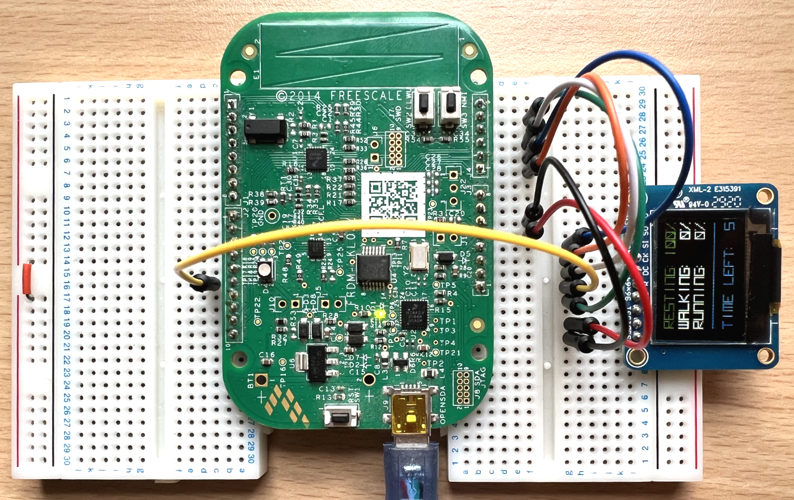

# Activity classifier firmware for the [Warp](https://github.com/physical-computation/Warp-hardware) family of hardware platforms

Gaussian Naive Bayes activity classifier based on the Warp firmware for the FRDM KL03 evaluation board. It uses the MMA8451Q accelerometer to collect collect data and the SSD1331 OLED display to show the results. For the system to work properly, it is expected for the user to carry the system in their dominant hand.

## Authors
**Antoni Wojcik
Hughes Hall, University of Cambridge
CRSid: ajw308**

The code is based on the [Warp](https://github.com/physical-computation/Warp-firmware) firmware written by Phillip Stanley-Marbell and Martin Rinard.

## Basis of operation 
The firmware initialzies drivers for the sensors and displays in [boot.c](./src/boot/ksdk1.1.0/boot.c). The main code responsible for classifying activity is contained in the `main()` function which uses the [tracker.c](./src/boot/ksdk1.1.0/tracker.c) code to collect and analyse data. Data processing is done in the following steps:

1. Collect acceleration data on x, y, z axes at 20 Hz rate in 10 s window, using the [devMMA8451Q.c](./src/boot/ksdk1.1.0/devMMA8451Q.c) driver.
2. At the end of the widnow, extract 4 features: standard deviation of acceleration along x, y, z, and the mean magntiude of accelration vector.
3. Use a pre-trained Gaussian Naive Bayes classifier to obtain the most likely classification of activity and the uncertainty in classification. The classifier was trained based on publicly available data [WISDM activity accelereomter dataset](https://www.cis.fordham.edu/wisdm/dataset.php).

> Jennifer R. Kwapisz, Gary M. Weiss and Samuel A. Moore (2010). Activity Recognition using Cell Phone Accelerometers, Proceedings of the Fourth International Workshop on Knowledge Discovery from Sensor Data (at KDD-10), Washington DC.

4. Once the classification is done, show the results on the OLED display using the [devSSD1331.c](./src/boot/ksdk1.1.0/devSSD1331.c) driver.

5. Clear measurement and feature buffers and start another measurement window by going back to step 1.

## Operation of the firmware on the FRDM KL03 evaluation board



The MMA8451Q sensor is embedded within the FRDM KL03 evaluation board and the SSD1331 display needs to be connected with the external pins in the following way:

1. GND   - GND 
2. 5V    - VCC
3. PTB13 - OCS
4. PTB0  - RST
5. PTA12 - D/C
6. PTA9  - SCK
7. PTA8  - MOSI

Once the firmware is built, the display should show a notification about the first measurement being taken:
"Booted... Running"
Below, there should be a timer counting down time until the end of the measurement window "Timer 9" to "Timer 0".

Upon the completion of the first analysis, a list of classes and the probabilities of them describing the activity appears. The most likely class is marked in green. There is a timer underneath as on the initial screen.

This behaviour is then looped in around 10s cycles.

## Layout of the repository

In this work, I started with the original [Warp repository](https://github.com/physical-computation/Warp-firmware). Then I modified [boot.c](./src/boot/ksdk1.1.0/boot.c) by removing the Warp menu implementation and redundant related functions. Instead, I wrote the loop that handles data acquisition and processing and displaying the results.

Therefore, all the modified files are:

1. Main file:\
[src/boot/ksdk1.1.0/boot.c](./src/boot/ksdk1.1.0/boot.c)

2. Activity tracker/classifier code:\
[src/boot/ksdk1.1.0/tracker.h](src/boot/ksdk1.1.0/tracker.h)\
[src/boot/ksdk1.1.0/tracker.c](src/boot/ksdk1.1.0/tracker.c)

3. MMA8451Q accelerometer driver:\
[src/boot/ksdk1.1.0/devMMA8451Q.h](src/boot/ksdk1.1.0/devMMA8451Q.h)\
[src/boot/ksdk1.1.0/devMMA8451Q.c](src/boot/ksdk1.1.0/devMMA8451Q.c)

4. SSD1331 OLED display driver:\
[src/boot/ksdk1.1.0/devSSD1331.h](./src/boot/ksdk1.1.0/devSSD1331.h)\
[src/boot/ksdk1.1.0/devSSD1331.c](./src/boot/ksdk1.1.0/devSSD1331.c)

5. Config files and other:\
[src/boot/ksdk1.1.0/warp.h](./src/boot/ksdk1.1.0/warp.h)\
[src/boot/ksdk1.1.0/config.h](./src/boot/ksdk1.1.0/config.h)

6. Make/CMake files:\
[Makefile](Makefile)\
[src/boot/ksdk1.1.0/CMakeLists-Warp.txt](./src/boot/ksdk1.1.0/CMakeLists-Warp.txt)

7. Python script used to train the classifier:\
[analyse.py](analyse.py)


## Building the repository

To build this project, insert these files into the [Warp repository](https://github.com/physical-computation/Warp-firmware), or replace the [src](./src/) folder with the attached src folder and the [Makefile](Makefile), then follow building instructions for the baseline Warp firmware given below.


# Baseline firmware for the [Warp](https://github.com/physical-computation/Warp-hardware) family of hardware platforms
This is the firmware for the [Warp hardware](https://github.com/physical-computation/Warp-hardware) and its publicly available and unpublished derivatives. This firmware also runs on the Freescale/NXP FRDM KL03 evaluation board which we use for teaching at the University of Cambridge. When running on platforms other than Warp, only the sensors available in the corresponding hardware platform are accessible.

**Prerequisites:** You need an arm cross-compiler such as `arm-none-eabi-gcc` installed as well as a working `cmake` (installed, e.g., via `apt-get` on Linux or via [MacPorts](https://www.macports.org) on macOS). On Ubuntu, the package you need is `gcc-arm-none-eabi`. You will also need an installed copy of the SEGGER [JLink commander](https://www.segger.com/downloads/jlink/), `JlinkExe`, which is available for Linux, macOS, and Windows (here are direct links for downloading it for [macOS](https://www.segger.com/downloads/jlink/JLink_MacOSX.pkg), and [Linux tgz 64-bit](https://www.segger.com/downloads/jlink/JLink_Linux_x86_64.tgz)).

## 1.  Compiling the Warp firmware
First, edit [setup.conf](setup.conf) to set the variable `ARMGCC_DIR` and `JLINKPATH`. If your `arm-none-eabi-gcc` is in `/usr/local/bin/arm-none-eabi-gcc`, then you want to set  `ARMGCC_DIR` to `/usr/local`. In the following, this `README.md` will refer to the top of the repository as `$TREEROOT`. On some platforms, you might need to also, in addition, set the `ARMGCC_DIR` environment variable in your shell (using `setenv` or `export` as appropriate), to point to the same path as you set in [setup.conf](setup.conf).

Second, edit [`tools/scripts/glaux.jlink.commands`](tools/scripts/glaux.jlink.commands) and [`tools/scripts/warp.jlink.commands`](tools/scripts/warp.jlink.commands) to replace `<full-path-to-warp-firmware>` with the full path to your Warp firmware directory.

Third, build the Warp firmware by

	make warp

Fourth, load the Warp firmware to hardware by

	make load-warp

To build for the Glaux variant, use `make glaux` and `make load-glaux` in steps three and four instead.

The build process copies files from `src/boot/ksdk1.1.0/` into the `build/`, builds, and converts the binary to SREC. See `Warp/src/boot/ksdk1.1.0/README.md` for more. _When editing source, edit the files in `src/boot/ksdk1.1.0/`, not the files in `build` location, since the latter are overwritten during each build._

To connect to the running hardware to see output, you will need two terminal windows. In a separate shell window from the one in which you ran `make load-warp` (or its variants), launch the JLink RTT client<sup>&nbsp;<a href="#Notes">See note 1 below</a></sup>:

	JLinkRTTClient

## 2. Using the Warp firmware on the Freescale FRDMKL03 Board
The SEGGER firmware allows you to use SEGGER’s JLink software to load your own firmware to the board, even without using their specialized JLink programming cables. You can find the SEGGER firmware at the SEGGER Page for [OpenSDA firmware](https://www.segger.com/products/debug-probes/j-link/models/other-j-links/opensda-sda-v2/).

To build the Warp firmware for the FRDM KL03, you will need to modify [this line in `src/boot/ksdk1.1.0/config.h`](https://github.com/physical-computation/Warp-firmware/blob/9e7f9e5e3f3c039cc98cbd1e6dfeb6b8fd78c86a/src/boot/ksdk1.1.0/config.h#L55).


## 3.  Editing the firmware
The firmware is currently all in `src/boot/ksdk1.1.0/`, in particular, see `src/boot/ksdk1.1.0/warp-kl03-ksdk1.1-boot.c` and the per-sensor drivers in `src/boot/ksdk1.1.0/dev*.[c,h]`.

The firmware builds on the Kinetis SDK. You can find more documentation on the Kinetis SDK in the document [doc/Kinetis SDK v.1.1 API Reference Manual.pdf](https://github.com/physical-computation/Warp-firmware/blob/master/doc/Kinetis%20SDK%20v.1.1%20API%20Reference%20Manual.pdf).

The firmware is designed for the Warp and Glaux hardware platforms, but will also run on the Freescale FRDM KL03 development board. In that case, the only sensor driver which is relevant is the one for the MMA8451Q. For more details about the structure of the firmware, see [src/boot/ksdk1.1.0/README.md](src/boot/ksdk1.1.0/README.md).


----

### If you use Warp in your research, please cite it as:
Phillip Stanley-Marbell and Martin Rinard. “A Hardware Platform for Efficient Multi-Modal Sensing with Adaptive Approximation”. ArXiv e-prints (2018). arXiv:1804.09241.

**BibTeX:**
```
@ARTICLE{1804.09241,
	author = {Stanley-Marbell, Phillip and Rinard, Martin},
	title = {A Hardware Platform for Efficient Multi-Modal 
	Sensing with Adaptive Approximation},
	journal = {ArXiv e-prints},
	archivePrefix = {arXiv},
	eprint = {1804.09241},
	year = 2018,
}
```
Phillip Stanley-Marbell and Martin Rinard. “Warp: A Hardware Platform for Efficient Multi-Modal Sensing with Adaptive Approximation”. IEEE Micro, Volume 40 , Issue 1 , Jan.-Feb. 2020.

**BibTeX:**
```
@ARTICLE{8959350,
	author = {P. {Stanley-Marbell} and M. {Rinard}},
	title = {Warp: A Hardware Platform for Efficient Multi-Modal
	Sensing with Adaptive Approximation},
	journal = {IEEE Micro},
	year = {2020},
	volume = {40},
	number = {1},
	pages = {57-66},
	ISSN = {1937-4143},
	month = {Jan},
}
```
### Acknowledgements
This research is supported by an Alan Turing Institute award TU/B/000096 under EPSRC grant EP/N510129/1, by Royal Society grant RG170136, and by EPSRC grants EP/P001246/1 and EP/R022534/1.

----
### Notes
<sup>1</sup>&nbsp; On some Unix platforms, the `JLinkRTTClient` has a double echo of characters you type in. You can prevent this by configuring your terminal program to not echo the characters you type. To achieve this on `bash`, use `stty -echo` from the terminal. Alternatively, rather than using the `JLinkRTTClient`, you can use a `telnet` program: `telnet localhost 19021`. This avoids the JLink RTT Client's "double echo" behavior but you will then need a carriage return (&crarr;) for your input to be sent to the board. Also see [Python SEGGER RTT library from Square, Inc.](https://github.com/square/pylink/blob/master/examples/rtt.py) (thanks to [Thomas Garry](https://github.com/tidge27) for the pointer).
